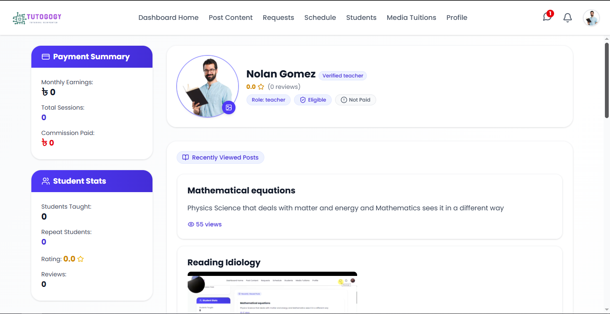
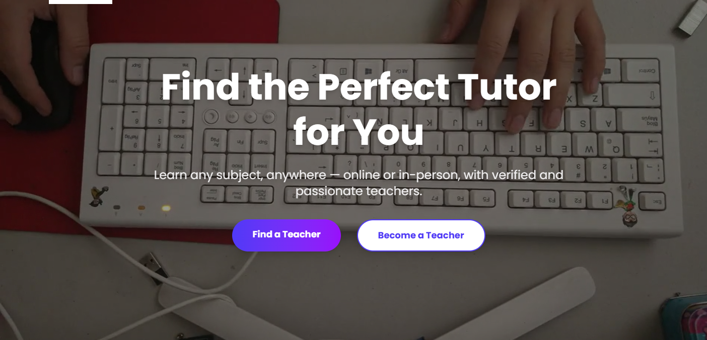
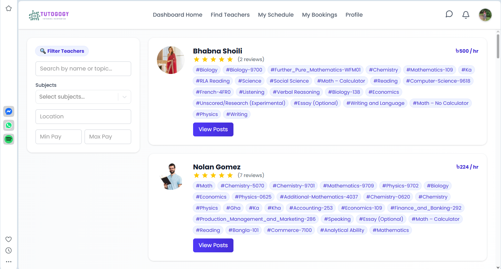
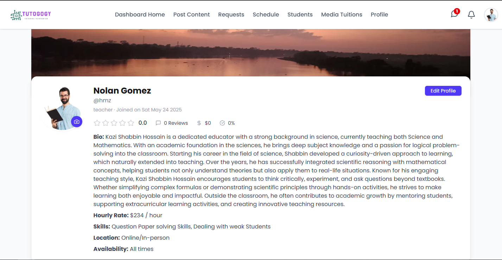

# Tuition Platform

A full-stack tuition management and teaching platform with a clear separation between frontend and backend services.

## 🔗 Project Repositories
- 🎨 Frontend: [Teaching Platform Frontend](https://github.com/Shabbin/teaching-platform)  
- 🧠 Backend: [Teaching Platform Backend](https://github.com/Shabbin/teaching-platform)  

## 🧱 Tech Stack
### Frontend
- React
- Tailwind CSS

### Backend
- Node.js
- Express
- MongoDB

## ✨ Features
- Student & teacher interaction
- Tuition management workflow
- Chat functionality
- Recent views & activity tracking
- RESTful API architecture
- Responsive user interface

## 📸 Screenshots
### Dashboard

### Home

### Student View

### Teacher View

## 🚀 Live Demo
[Check it out here!](https://teaching-platform-beige.vercel.app/)
